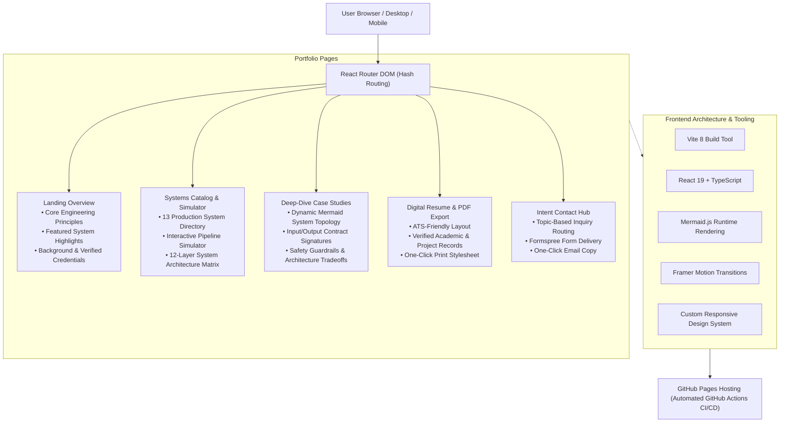

<div align="center">
  <h1>Dhruv Gupta</h1>
  <p><strong>Software Engineer & AI Systems Builder</strong></p>
  <p>Final-Year B.Tech in Computer Science and Engineering @ KIIT Bhubaneswar (CGPA 9.45, Graduating July 2027) &bull; GATE DA 2026 (AIR 1109)</p>

  <p>
    <a href="https://dhruvg334.github.io/dhruv-gupta-portfolio/"><strong>Explore Live Portfolio &rarr;</strong></a>
  </p>

  <p>
    <a href="https://github.com/Dhruvg334"></a>
    <a href="https://www.linkedin.com/in/dhruv-gupta-7a7500287/"></a>
    <a href="mailto:dhruvg3304@gmail.com"></a>
  </p>
</div>

---

## Purpose

This repository contains the source code for my personal engineering portfolio. The goal of this site is to present 13 production systems built around AI models, highlighting practical software engineering: verifiable system architectures, deterministic business logic, safety guardrails, and human review gates.

---

## Website Architecture



---

## Featured Systems Directory

| # | System | Domain | Key Architecture |
|---|---|---|---|
| **01** | [**Civitas**](https://civitas-web.vercel.app) | Civic Intelligence | Canvas image compression, H3 hexagonal clustering, BM25+Dense policy routing, SHA-256 audit seals |
| **02** | [**Mnemos**](https://mnemos-lake.vercel.app) | Industrial GraphRAG | Asset hierarchy resolution, hybrid vector/graph retrieval, 11-stage LangGraph supervisor |
| **03** | [**A-DAP-T**](https://a-dap-t.vercel.app) | AI Agent Security | Static AST code scanner, 16-point guardrail verification, tri-state release gate |
| **04** | [**ChronOS**](https://chronos-dhruv.netlify.app) | Schedule Optimizer | Collision-free interval packing, two-way Google Calendar synchronization with rollback receipts |
| **05** | [**Tessarion**](https://github.com/Dhruvg334/Tessarion) | Graph-Based Learning | Neo4j concept prerequisite DAG, teach-back diagnostic evaluation, 50+ automated Vitest suites |
| **06** | [**Carbonly**](https://carbonlyai.netlify.app/) | Carbon Accounting | Deterministic GHG calculations, 5x5 Gauss-Jordan Mahalanobis matrix inversion, Primal Simplex optimizer |
| **07** | [**Daedalus**](https://daedalus-iota.vercel.app/) | Career Simulation | Feature vector normalization, task-level AI exposure matrix, 7-day action sprint plans |
| **08** | [**AIDYN**](https://github.com/Dhruvg334/aidyn) | Disaster Response | Deterministic 4-module priority scoring, resource deficit matching, emergency supervisor review gate |
| **09** | [**Preliator**](https://github.com/Dhruvg334/Preliator) | Security Audit Engine | Pre-release AST auditor, trust boundary analysis, automated patch and diff generation |
| **10** | [**Exorno**](https://github.com/Dhruvg334/Exorno) | Supply Chain Risk | Milestone dependency DAG, purchase order discrepancy analysis, critical-path delay prediction |
| **11** | [**Shodhak**](https://shodhak-mu.vercel.app) | Adventure Discovery | Regional outdoor trail curation, multi-day itinerary generator, transit buffer validation |
| **12** | [**NewsPortal**](https://github.com/Dhruvg334/NewsPortal) | Fact Verification | Multi-model machine learning ensemble, DistilBERT classification, live Fact Check API integration |
| **13** | [**Niswarth AI**](https://github.com/Dhruvg334/Niswarth-AI) | NGO Fiscal Auditor | Multi-agent LangGraph supervisor, receipt ledger math, PostgreSQL Row-Level Security isolation |

---

## Tech Stack

- **Frontend:** React 19, TypeScript, React Router DOM
- **Build & Bundling:** Vite 8, Rolldown
- **Diagrams & Visualizations:** Mermaid.js, Cytoscape.js
- **Styling:** Custom CSS with CSS variables, responsive grids, and print media rules
- **Animations:** Motion (`motion/react`)
- **Icons:** Lucide React
- **Forms:** Formspree API integration
- **Hosting & CI/CD:** GitHub Pages via GitHub Actions

---

## Local Setup

```bash
# 1. Clone the repository
git clone https://github.com/Dhruvg334/dhruv-gupta-portfolio.git
cd dhruv-gupta-portfolio

# 2. Install dependencies
npm install

# 3. Start local development server
npm run dev

# 4. Create production build
npm run build

# 5. Preview production build locally
npm run preview
```

---

## Contact

- **Email:** [dhruvg3304@gmail.com](mailto:dhruvg3304@gmail.com)
- **LinkedIn:** [linkedin.com/in/dhruv-gupta-7a7500287](https://www.linkedin.com/in/dhruv-gupta-7a7500287/)
- **GitHub:** [github.com/Dhruvg334](https://github.com/Dhruvg334)
- **Portfolio:** [dhruvg334.github.io/dhruv-gupta-portfolio](https://dhruvg334.github.io/dhruv-gupta-portfolio/)
